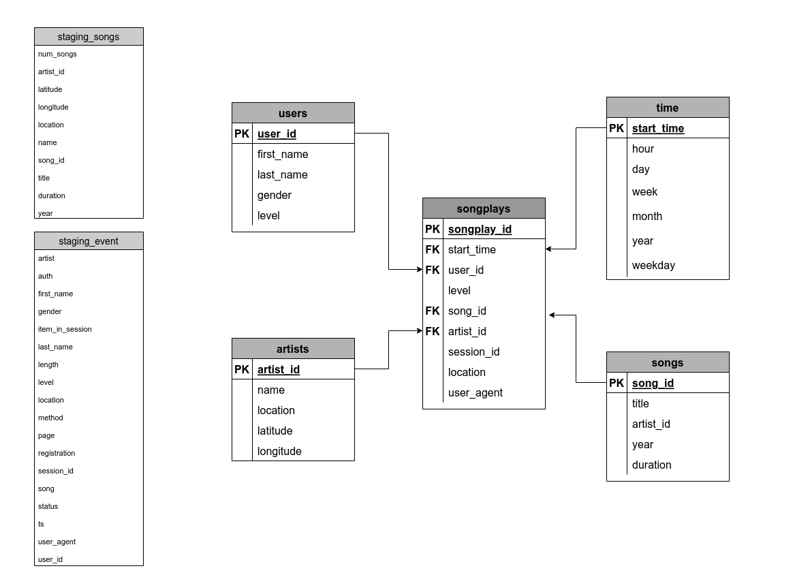
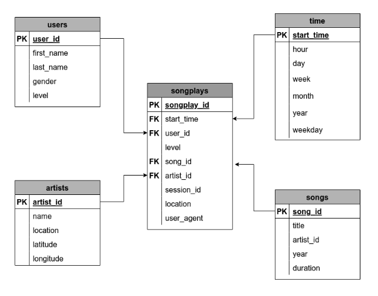

# Summary

- Sparkify startup requested to move user base and song database to the cloud.
- Extract, Transform and Load (ETL) pipeline extracts JSON data files from Amazon Simple Storage Service (S3) data storage and load them into a star schema relational database on Amazon Redshift data warehouse.


# Data
Data for song and user activities reside in S3 as JSON files:
- Song data: s3://udacity-dend/song_data
- Log data: s3://udacity-dend/log_data
- Log data json path: s3://udacity-dend/log_json_path.json

## Song data 
- subset of real data from the [Million Song Dataset](http://millionsongdataset.com/).
- each file is in JSON format 
- contains metadata about a song and the artist of that song. 
- files are partitioned by the first three letters of each song's track ID. 
- example of file paths to two files in song dataset.
>```
song_data/A/B/C/TRABCEI128F424C983.json
song_data/A/A/B/TRAABJL12903CDCF1A.json
```

- example of single song file, TRAABJL12903CDCF1A.json:
>```
{"num_songs": 1, 
"artist_id": "ARJIE2Y1187B994AB7", 
"artist_latitude": null, 
"artist_longitude": null, 
"artist_location": "", 
"artist_name": "Line Renaud", 
"song_id": "SOUPIRU12A6D4FA1E1", 
"title": "Der Kleine Dompfaff", 
"duration": 152.92036, 
"year": 0}
```

## Log data 
- log files in JSON format generated by [event simulator](https://github.com/Interana/eventsim) based on the songs in the song dataset.
- these simulate activity logs from a music streaming app based on specified configurations.
- log files are partitioned by year and month. 
- example, here are filepaths to two files in log dataset.
>```
log_data/2018/11/2018-11-12-events.json
log_data/2018/11/2018-11-13-events.json
```
- example of single log file, 2018-11-12-events.json:

>```
{"artist":null,
"auth":"Logged In",
"firstName":"Celeste",
"gender":"F",
"itemInSession":0,
"lastName":"Williams",
"length":null,
"level":"free",
"location":"Klamath Falls, OR",
"method":"GET",
"page":"Home",
"registration":1541077528796.0,
"sessionId":438,
"song":null,
"status":200,
"ts":1541990217796,
"userAgent":"\"Mozilla\/5.0 (Windows NT 6.1; WOW64) AppleWebKit\/537.36 (KHTML, like Gecko) Chrome\/37.0.2062.103 Safari\/537.36\"",
"userId":"53"}
```


# Staging tables

## staging_songs
> staging table for the song data

| Column    | Type      |                    
| --------- | ----------|
| num_songs | varchar   |                     
| artist_id | varchar   |                     
| latitude  | float     |                     
| longitude | float     |                     
| location  | varchar   |                     
| name      | varchar   |                     
| song_id   | varchar   |                     
| title     | varchar   |  
| duration  | float     |                     
| year      | int       | 

## staging_events
> staging table for the log data

| Column          | Type      |                    
| --------------- | ----------|
| artist          | varchar   |                     
| auth            | varchar   |                     
| first_name      | varchar   |                     
| gender          | char(1)   |                  
| item_in_session | int       |                     
| last_name       | varchar   |                     
| length          | float     |                     
| level           | varchar   |                     
| location        | varchar   |                     
| method          | varchar   |                     
| page            | varchar   |                     
| registration    | varchar   |                     
| session_id      | int       |                     
| song            | varchar   |                     
| status          | int       |                     
| ts              | timestamp |                   
| user_agent      | varchar   |                     
| user_id         | int       |                     
 

# Schema for Song Play Analysis
- Star schema that contains **1** fact table (**songplays**) and **4** dimension tables (**users**, **songs**, **artists** and **time**)



## Fact Table
### songplays
> records in log data associated with song plays i.e. records with page NextSong

| Column | Type | Nullable|
| ------ | ----- | --------- |
| songplay_id (PK)| SERIAL| NOT NULL |
| start_time| timestamp| NOT NULL |
| user_id| int| NOT NULL |
| level| varchar| |
| song_id| varchar| |
| artist_id| varchar| |
| session_id| int| |
| location| varchar| |
| user_agent| varchar| |

- Distribution Style: KEY start_time
- Sorting key: start_time

## Dimension Tables

### users
> users in the app

| Column | Type | Nullable|
| ------ | ----- | --------- |
| user_id (PK)| int| NOT NULL |
| first_name| varchar||
| last_name| varchar||
| gender| varchar| |
| level| varchar| |

- Sorting key: user_id

### songs 
> songs in music database

| Column | Type | Nullable|
| ------ | ----- | --------- |
| song_id (PK)| varchar| NOT NULL |
| title| varchar| NOT NULL |
| artist_id| varchar| NOT NULL |
| year| int| |
| duration| numeric| NOT NULL |

- Sorting key: song_id

### artists
> artists in music database

| Column | Type | Nullable|
| ------ | ----- | --------- |
| artist_id (PK)| varchar| NOT NULL |
| name| varchar| |
| location| varchar| |
| latitude| float| |
| longitude| float| |

- Sorting key: artist_id

### time 
> timestamps of records in songplays broken down into specific units

| Column | Type | Nullable|
| ------ | ----- | --------- |
| start_time (PK)| timestamp| NOT NULL |
| hour| int| |
| day| int| |
| week| int| |
| month| int| |
| year| int| |
| weekday| int| |

- Distribution Style: KEY start_time
- Sorting key: start_time
    
# Project files

## sql_queries.py
- contains all the sql queries

## create_tables.py 
- drops and creates the tables. 
- run this file to reset the tables before each time you run the ETL scripts.

## etl.py 
- reads and processes files from S3
- loads data into the tables.

# How to run the scripts:

- open terminal

- run _create_tables.py_ to drop an create tables:

>    ``
    python create_tables.py
    ``

- run _etl.py_ to process files and load data:

>    ``
    python etl.py
    ``